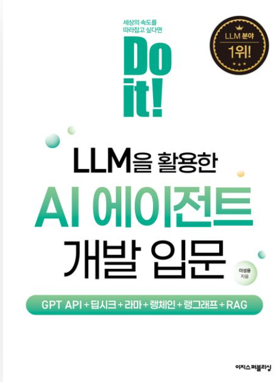

# 🤖 LLM을 활용한 AI 에이전트 개발 입문

『LLM을 활용한 AI 에이전트 개발 입문』 실습 프로젝트 저장소입니다.
<div align="center">

<a href="https://product.kyobobook.co.kr/detail/S000216406434?utm_source=google&utm_medium=cpc&utm_campaign=googleSearch&gad_source=1">
  
</a>
<a href="https://product.kyobobook.co.kr/detail/S000216406434?utm_source=google&utm_medium=cpc&utm_campaign=googleSearch&gad_source=1">
책 보러가기 ↗
</a>
</div>

GPT API, LangChain, LangGraph, RAG, 멀티 에이전트 등 AI 에이전트를 직접 구현하며 학습한 내용을 정리하였습니다.

---

## 📚 프로젝트 소개

이 저장소는 『LLM을 활용한 AI 에이전트 개발 입문』의 실습 코드를 기반으로 작성되었습니다.

학습 과정에서 단순 실습에 그치지 않고, AI 에이전트 개발 역량을 체계적으로 학습하는 것을 목표로 합니다.

- 코드 구현
- 실험 결과 기록
- 주요 개념 정리
- 개선 아이디어 정리


---

## 🛠 기술 스택

- Python
- OpenAI GPT API
- LangChain
- LangGraph
- RAG (Retrieval-Augmented Generation)
- Vector Database
- Multi-Agent System

---

## 📂 프로젝트 구조

```text
.
├── chap01/
│   ├── chapter01.md
│   └── ...
├── chap02/
│   ├── chapter02.md
│   └── ...
├── ...
└── README.md